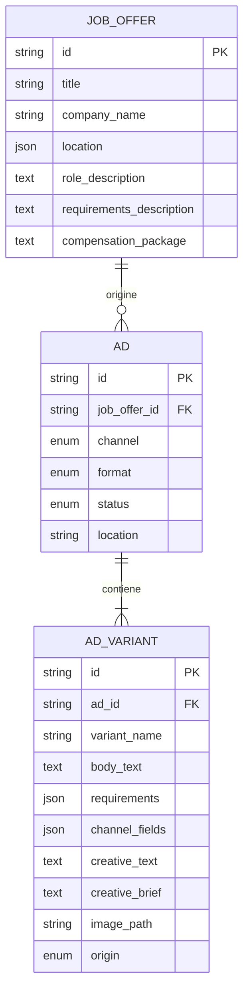

# Architettura

## Struttura

Il progetto mantiene una singola applicazione Python: FastAPI espone l’API e serve una pagina HTML con JavaScript vanilla. SQLAlchemy persiste i dati in SQLite; Pydantic definisce input e output. `app/llm/` è il confine con OpenAI e HTTPX, mentre i servizi coordinano repository, generazione e transazioni.

## Modello

- `JobOffer` conserva le informazioni interne: dati aziendali, descrizioni del ruolo, requisiti, competenze, retribuzione, contratto e sede originaria.
- `Ad` identifica una pubblicazione prevista per un canale. `channel` ammette `indeed`, `whatsapp`, `instagram` e `tiktok`; `format` ammette `text`, `image` e `image_text`; `status` ammette `draft`, `ready`, `published` e `archived`.
- `Ad.location` è il luogo mostrato per quello specifico annuncio. Non è derivato in modo permanente dalla sede della job offer e può differire tra annunci della stessa offerta.
- `AdVariant` contiene una versione del contenuto: titolo, body, requisiti, compenso, dati strutturati del canale, testo e brief della creative, immagine associata e origine (`llm` o `manual`). Più annunci e più varianti possono puntare alla stessa offerta.

Non c’è una tabella separata per canale: gli enum sono sufficienti per questo prototipo. `channel_fields` è JSON così il modello può conservare piccoli campi di pubblicazione specifici senza cambiare schema ad ogni canale. L’output generato usa un insieme controllato (`experience`, `employment_type`, `schedule`, `application_url`); varianti manuali possono conservare altri campi JSON.

## Flusso dei dati

1. `GET /api/job-offers` rende disponibili le offerte salvate. `python -m app.seed` inserisce l’offerta dimostrativa `jo_001` e annunci di esempio senza duplicarli.
2. La UI invia a `POST /api/ads` offerta, canale, formato e luogo facoltativo. Se il luogo manca, il servizio usa località e provincia dell’offerta.
3. Il servizio aggiunge l’annuncio alla sessione, costruisce il contesto LLM dai campi interni, omette via/civico e invia una richiesta sincrona a `POST /v1/responses` con output JSON Schema rigoroso.
4. `VariantDraft` valida forma, tipi, campi ammessi e coerenza tra formato e contenuto. Le regole richiedono body per `text`, creative per `image`, entrambi per `image_text`; Indeed richiede il campo esperienza.
5. Soltanto dopo la validazione viene creata la variante. Annuncio e prima variante vengono salvati in una transazione; errori LLM o database fanno rollback.
6. Le risposte API includono varianti per mostrare e modificare il contenuto. PATCH valida i valori finali, mantiene i campi omessi, imposta `origin=manual` e aggiorna `updated_at`.
7. Un’immagine viene controllata per dimensione, content type e firma, salvata con un nome UUID generato e associata alla variante. FastAPI la espone sotto `/uploads/`.

La richiesta imposta `store=false` per l’endpoint Responses e non include l’indirizzo civico dell’offerta. Il testo della job offer viene comunque inviato al provider per la generazione; non sono previste cifratura o policy di conservazione applicative aggiuntive.

## Rotte

| Metodo e percorso | Funzione |
| --- | --- |
| `GET /api/job-offers` | Elenca offerte. |
| `GET /api/job-offers/{id}` | Legge un’offerta o restituisce `404`. |
| `GET /api/ads` | Elenca annunci; `job_offer_id` e `channel` si possono combinare. |
| `GET /api/ads/{id}` | Legge annuncio e varianti o restituisce `404`. |
| `POST /api/ads` | Crea bozza e prima variante LLM, atomicamente. |
| `POST /api/ads/{id}/variants` | Genera una variante aggiuntiva. |
| `PATCH /api/ads/{id}` | Aggiorna luogo e/o stato. |
| `PATCH /api/ads/{id}/variants/{variant_id}` | Modifica parzialmente una variante manualmente. |
| `POST /api/ads/{id}/variants/{variant_id}/image` | Carica e associa PNG, JPEG o WebP. |

## Semplificazioni

SQLite e `create_all` evitano setup infrastrutturale ma non forniscono migrazioni per evoluzioni dello schema. Non ci sono autenticazione, permessi, pubblicazione reale, code, retry, metriche A/B o cronologia delle modifiche a una singola variante. SQLite e gli upload locali sono adatti a una demo singola, non a più istanze concorrenti.
